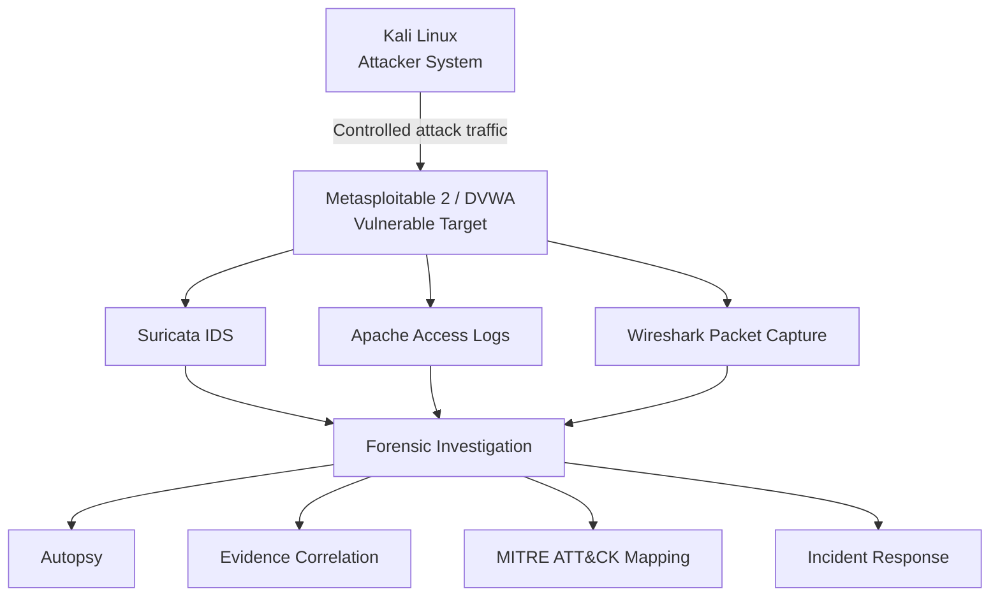

# Cyber Attack Detection & Incident Response Lab

A controlled security lab demonstrating SQL injection analysis, Suricata IDS detection, Wireshark traffic investigation, Apache log correlation, Autopsy forensics, MITRE ATT&CK mapping, and incident-response planning.

**Core Technologies:** DVWA, Suricata, Wireshark, Apache Logs, Autopsy.

## Project Objective

This project demonstrates how a controlled SQL injection scenario can be detected, investigated, correlated across multiple evidence sources, mapped to ATT&CK concepts, and translated into an incident-response workflow.

*Note: This repository contains reconstructed technical documentation and evidence from an isolated lab environment. The threat model was theoretically based on the 2023 MOVEit Transfer breach case study, but this lab specifically demonstrates fundamental security concepts against DVWA, not the actual MOVEit exploit.*

## Lab Architecture

The lab utilized a controlled, isolated network to simulate both the attacker and the victim, alongside security monitoring controls.

*Connectivity verification between the Kali Linux attacker system and the Metasploitable 2 target, establishing the isolated lab environment.*

## Security Workflow

The project follows a structured lifecycle from initial compromise to remediation:

1. **Attack Simulation**
2. **Detection Engineering**
3. **Network / Log Analysis**
4. **Digital Forensics**
5. **MITRE ATT&CK Mapping**
6. **Incident Response**

## Objectives

- Understand and simulate web application vulnerabilities in a safe, controlled manner.
- Develop custom intrusion detection rules to identify malicious activity.
- Correlate forensic evidence across network captures and server logs.
- Map observed behaviors and theoretical case-study techniques to the MITRE ATT&CK framework.
- Formulate an incident response workflow aligned with NIST concepts.

## Technologies Used

- **Operating Systems:** Kali Linux, Metasploitable 2
- **Vulnerable Application:** Damn Vulnerable Web App (DVWA)
- **Attack Tools:** sqlmap, manual SQL injection techniques
- **Detection & Monitoring:** Suricata IDS
- **Network & Log Analysis:** Wireshark, Apache Access Logs
- **Digital Forensics:** Autopsy
- **Frameworks:** MITRE ATT&CK, NIST Incident Response Lifecycle

## Attack Simulation Overview

To generate detectable traffic and forensic artifacts, a controlled attack simulation was conducted against the DVWA endpoint.

*Manual execution of a SQL injection payload against the DVWA target, demonstrating controlled database record extraction.*

## Detection Engineering

A critical component of the lab was configuring defensive mechanisms to identify the simulated attacks. This involved deploying Suricata IDS and engineering a custom detection rule designed to trigger on SQL injection indicators within HTTP traffic destined for the vulnerable DVWA endpoint. 

**Recovered lab detection rule:** [`detection-rules/suricata/local.rules`](detection-rules/suricata/local.rules)
*(Note: The original Suricata rule file is no longer available as a raw text artifact; the exact syntax was recovered directly from the original lab screenshot evidence.)*

*Custom Suricata IDS rule developed to detect SQL injection indicators targeting the vulnerable DVWA endpoint.*

*Suricata IDS alerts generated in response to the controlled SQL injection simulation, demonstrating successful network-based detection.*

## Network and Log Analysis

Following the attack simulation, network traffic and server logs were analyzed to trace the attacker's actions. This involved examining:
- **Wireshark Packet Captures:** Inspecting HTTP payloads for SQL syntax and automated tool signatures.
- **Apache Access Logs:** Reviewing web server requests to identify targeted endpoints and suspicious request patterns.

*Wireshark inspection of HTTP traffic associated with the controlled SQL injection simulation, providing network-level evidence that complements the Suricata IDS alerts and Apache server logs.*

## Digital Forensics

Evidence from multiple sources was consolidated and investigated in Autopsy. The multi-source technical investigation correlated key indicators across network captures and server logs to build a timeline of the simulated compromise scenario.

*Digital forensic investigation in Autopsy, correlating Apache access logs to identify HTTP requests containing SQL injection indicators.*

## MITRE ATT&CK Mapping

The lab and associated research involved mapping adversary behaviors to the MITRE ATT&CK framework. It is important to distinguish between the techniques analyzed theoretically versus those demonstrated practically:

**Techniques analyzed as part of the MOVEit breach case study:**
- T1190 - Exploit Public-Facing Application
- T1505.003 - Web Shell
- T1036 - Masquerading
- T1082 - System Information Discovery
- T1083 - File and Directory Discovery
- T1213 - Data from Information Repositories
- T1005 - Data from Local System
- T1041 - Exfiltration Over C2 Channel

**Behaviors practically demonstrated in the DVWA lab:**
- Exploitation of a web application vulnerability (SQL Injection).
- Automated database enumeration and data extraction.

## Incident Response Planning

Based on the forensic findings and aligned with NIST incident response concepts, a proposed response workflow was planned to address the simulated scenario:

*Overview of the incident response playbook developed to address the simulated web application scenario based on NIST guidelines.*

The planned playbook covers the following phases:
1. **Detection:** Identifying anomalous activity via IDS alerts and log entries.
2. **Validation:** Confirming the observed request matched the simulated SQL injection activity.
3. **Evidence Preservation:** Securing logs and packet captures for analysis.
4. **Exposure Assessment:** Assessing which database records may have been exposed or accessed.
5. **Containment:** Proposing actions to block the attacker's IP and restrict the vulnerable endpoint.
6. **Remediation:** Identifying application patching requirements to address the SQL injection flaw.
7. **Credential Review:** Recommending resets for any potentially exposed sessions or credentials.
8. **Recovery:** Defining steps to restore the application to normal operations.
9. **Monitoring:** Implementing enhanced detection rules to monitor the vulnerable endpoint.
10. **Lessons Learned:** Conducting a post-incident review to evaluate detection and response procedures.

## Documentation

| Phase | Description |
|---|---|
| [Lab Setup](docs/lab-setup.md) | Architecture and isolation boundaries of the controlled environment. |
| [Attack Simulation](docs/attack-simulation.md) | Controlled SQL injection testing against the DVWA target. |
| [Detection Engineering](docs/detection-analysis.md) | Suricata IDS rule development and alert analysis. |
| [Digital Forensics](docs/forensic-investigation.md) | Correlation of Apache logs and PCAP evidence using Autopsy. |
| [MITRE ATT&CK](docs/mitre-attack.md) | TTP mapping of the MOVEit breach case study. |
| [Incident Response](docs/incident-response.md) | NIST-aligned response workflow for a web application compromise. |

## Skills Demonstrated

- Network intrusion detection
- Suricata IDS rule analysis
- Network traffic analysis with Wireshark
- Web attack analysis (SQL injection testing in a controlled lab)
- Apache access-log analysis
- Digital forensics with Autopsy
- Evidence correlation across multiple security sources
- MITRE ATT&CK mapping
- Incident response planning

## Ethical and Safety Scope

All practical activities documented in this repository were performed in an isolated, locally hosted virtual environment (Kali Linux attacking Metasploitable 2) as part of an authorized university assignment. No external systems, networks, or real-world applications were targeted or compromised. This project serves purely as an educational portfolio piece demonstrating defensive security methodologies.

## Limitations

This repository is a post-event reconstruction of documentation from a completed academic lab. The original Kali Linux virtual machine and raw forensic artifacts (such as original packet captures and server logs) are no longer available. The documentation relies on the original final report, and no artifacts or evidence have been fabricated.
