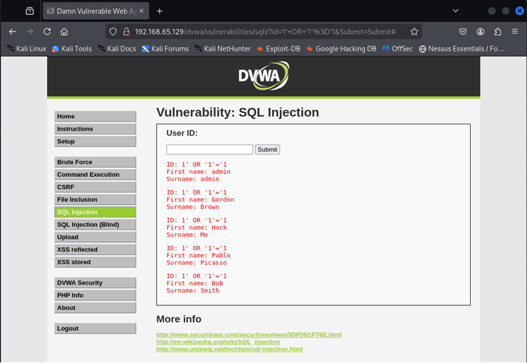
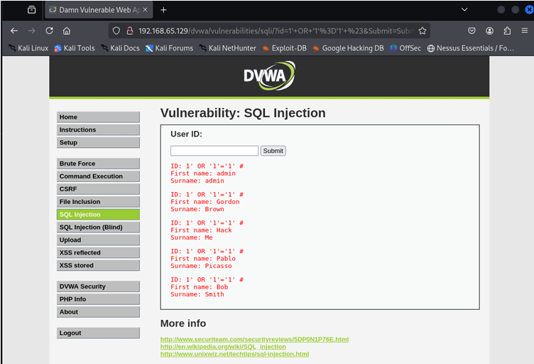
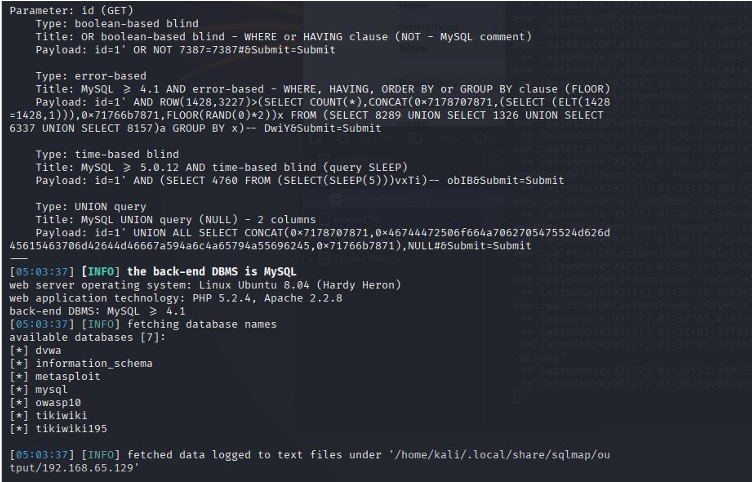

# Attack Simulation

The attack simulation phase focused on generating observable, realistic exploitation behavior within the controlled lab environment to facilitate subsequent detection and investigation exercises.

## Activity Summary

The simulation demonstrated a web application compromise workflow against the intentionally vulnerable DVWA target. The verified activities included:

1. **Connectivity Verification:** Establishing and confirming network communication between the Kali Linux attacker system and the Metasploitable 2 target.
2. **Target Identification:** Interacting with DVWA as the designated vulnerable web application.
3. **Manual Vulnerability Discovery:** Demonstrating SQL injection behavior manually against the vulnerable application endpoint.

*Manual execution of a SQL injection payload against the DVWA target, extracting dummy user records to simulate a data breach.*

4. **Automated Validation:** Utilizing `sqlmap` to validate the extent of the SQL injection vulnerability.

*Automated vulnerability validation and exploitation using sqlmap to map the DVWA SQL injection vulnerability.*

5. **Database Enumeration:** Performing controlled enumeration of the backend database structure.

*Database enumeration demonstrating the controlled extraction of backend schema and table names.*

6. **Data Extraction:** Demonstrating the controlled extraction of DVWA dummy user records to simulate data exfiltration.

## Objective and Relevance

The primary objective was not to learn exploitation techniques, but to create a measurable incident. By generating observable security behavior, the simulation provided the necessary artifacts (network traffic, server logs, system state changes) to practice detection engineering and incident response. This demonstrates the defensive relevance of understanding offensive tactics.

## Evidence Generated

The simulated activities successfully generated technical evidence observable across multiple security controls:

- **Network Traffic:** Raw packet data containing the exploitation payloads.
- **Suricata IDS Alerts:** Network-based alerts triggered by suspicious traffic patterns.
- **Apache HTTP Access Logs:** Server-side records of the anomalous HTTP requests.
- **Packet Captures (PCAP):** Preserved network traffic for deep forensic analysis.
- **Forensic Artifacts:** System data available for post-incident examination.
