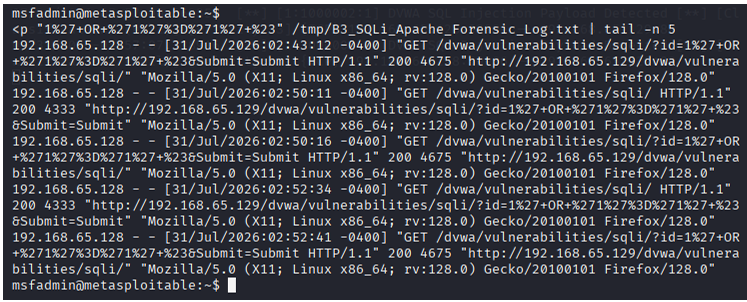

# Detection Engineering

## Detection Objective

The core objective of this phase was to identify the simulated attack traffic by engineering network-based detection mechanisms. This involved analyzing the attack behavior and developing signatures to alert on malicious indicators without relying purely on endpoint logs.

## Suricata IDS

Suricata was deployed as a Network Intrusion Detection System (NIDS) to monitor traffic flowing to the vulnerable Metasploitable 2 host. 

*(Note: The original Suricata rule file is no longer available as a raw text artifact, but its contents have been successfully recovered from the original lab screenshots.)*

## Detection Logic

The original custom rule was engineered specifically to detect SQL injection indicators associated with HTTP requests targeting the vulnerable DVWA endpoint. The detection logic evaluated multiple indicators, including:

- Vulnerable endpoint and HTTP request characteristics.
- Encoded quotation characters typically used to break out of SQL syntax.
- SQL-related keywords injected into parameters.
- Encoded SQL comment markers used to alter backend query logic.

*Custom Suricata IDS rule developed to detect SQL injection indicators targeting the vulnerable DVWA endpoint.*

## Alert Validation

Upon re-execution of the attack simulation, Suricata successfully evaluated the network traffic against the detection logic and produced alerts corresponding to the suspicious HTTP requests. This validated the efficacy of the engineered rule in identifying the targeted behavior.

*Suricata IDS alerts generated in response to the controlled SQL injection simulation, demonstrating successful network-based detection.*

*Wireshark inspection of HTTP traffic associated with the controlled SQL injection simulation, providing network-level verification of the malicious payloads.*

## Apache Log Correlation

Independent of the network-based IDS alerts, the Apache HTTP access logs on the target system successfully recorded the corresponding HTTP activity. The logs provided a secondary, server-level confirmation of the requests that triggered the Suricata alerts, establishing a foundation for evidence correlation.

*Server-side evidence of the attack captured in Apache HTTP access logs, confirming the malicious requests reached the target application.*

## Detection Limitations

The detection engineering process highlighted inherent limitations in signature-based detection. Because the IDS relies on observable, predefined patterns, it is susceptible to evasion if attackers encode or obfuscate payloads differently. Furthermore, poorly tuned rules can result in false positives (alerting on benign traffic) or false negatives (missing actual attacks), underscoring the need for continuous rule tuning and behavioral analysis.
