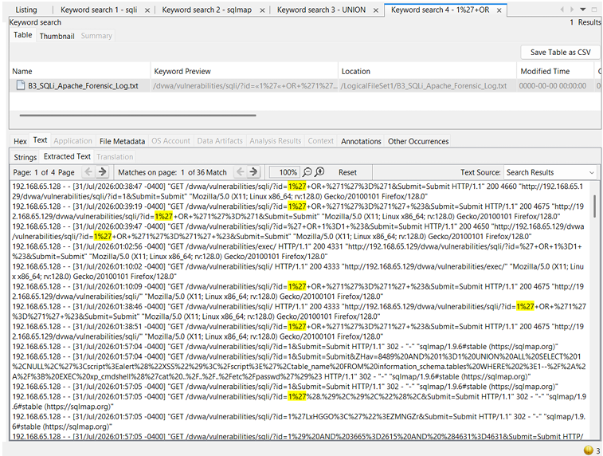

# Digital Forensic Investigation

## Investigation Objective

The objective of the forensic investigation was to analyze and correlate the technical evidence generated during the attack simulation to reconstruct the timeline, scope, and impact of the simulated scenario.

## Network Evidence - Wireshark

Wireshark was utilized to perform deep packet inspection of the captured network traffic. By analyzing the packet captures, specific HTTP traffic was inspected to identify the anomalous requests and payloads directly associated with the controlled SQL injection activity.

## Server Evidence - Apache

The Apache HTTP access logs were extracted and examined. These server-side logs provided critical context regarding the web application's perspective of the attack, allowing investigators to identify the exact HTTP requests, status codes, and user-agent strings associated with the malicious activity.

## Forensic Examination - Autopsy

Autopsy was employed as part of the digital forensic investigation process. It provided a centralized platform to ingest, inspect, and correlate the available evidence, facilitating a structured review of the artifacts associated with the simulated scenario.


*Digital forensic investigation in Autopsy, correlating Apache access logs to identify HTTP requests containing SQL injection indicators.*

## Evidence Correlation

A key component of the investigation was the correlation of disparate evidence sources to form a cohesive understanding of the observed SQL injection activity. The investigation successfully correlated indicators such as the attacker/source IP, target/destination IP, requested web endpoints, specific HTTP activity, SQL injection indicators, and available timestamps.

```text
Suricata Alert
      |
      v
Suspicious HTTP Request
      |
      +--> Wireshark
      +--> Apache Access Log
      +--> Autopsy
              |
              v
       Correlated Incident
```

Evidence correlation is a fundamental step in incident investigation because it verifies findings across independent sources, reducing the likelihood of relying on tampered logs or single points of failure. It enables analysts to confidently confirm the attack vector, scope of exposure, and the sequence of events.
